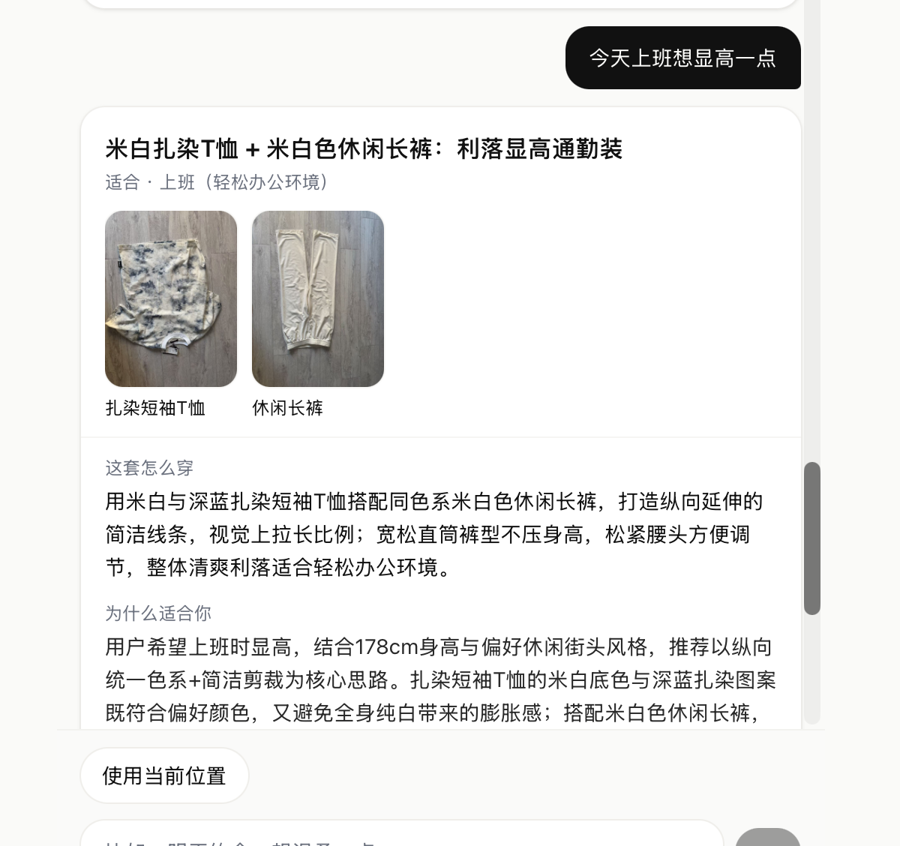

# OutfitAI

## AI 私人穿搭与购物决策助手

OutfitAI 面向「衣橱里有衣服，但不知道怎么搭」的用户。它从用户的真实衣橱中选择单品，结合场景、天气、个人信息、风格记忆与穿搭知识，生成可执行、可解释的个性化穿搭方案。

**核心价值：** 真实衣橱约束，减少 AI 编造 · 反馈驱动 Memory，持续学习偏好 · 覆盖日常穿搭、旅行规划与购物决策

**当前形态：** Next.js Web + Expo 移动端 MVP · **AI 模型：** Qwen3-VL-Plus · **产品阶段：** V2 功能验证与稳定 Demo

[核心功能](#2-核心功能) · [AI-Workflow](#4-ai-workflow) · [评测与质量保障](#10-评测集与质量保障) · [本地运行](#13-本地运行)



> Demo：用户输入「今天上班想显高一点」，系统从真实衣橱中召回候选单品，并结合个人画像与穿搭知识生成推荐及解释。

---

## 1. 项目简介

### 解决什么问题

- 衣橱里衣服不少，但每天仍不知道穿什么
- 场景多变（通勤、约会、旅行、购物），缺少结构化搭配建议
- 普通 Chatbot 容易「编造不存在的衣服」，缺乏可落地的衣橱约束
- 用户偏好难以沉淀，推荐难以越用越准

### 产品价值

OutfitAI 把「衣橱数据 + 场景理解 + 规则召回 + 轻量 RAG 知识 + LLM 组合解释」串成一条完整链路：

1. 先约束在**真实衣橱**内选品，降低幻觉
2. 再注入**天气、风格画像、个人信息、穿搭知识**，提高专业度
3. 通过**反馈与事件日志**持续优化体验，并支持校招/面试场景下的效果展示与复盘

---

## 2. 核心功能

| 模块 | 路径 | 说明 |
|------|------|------|
| 数字衣橱 | `/closet` | 单件上传、Qwen Vision 识别属性、分类筛选、详情、删除；图片存 Supabase Storage |
| AI 穿搭推荐 | `/` | 自然语言输入需求，从衣橱生成搭配；支持当前位置天气；结果保存至 `outfit_recommendations` |
| 天气推荐 | 首页 | 基于浏览器定位 + WeatherAPI；失败时降级为普通推荐，不阻断主流程 |
| Memory 风格画像 | `/profile/style` | 喜欢/不喜欢/收藏更新 `user_style_profiles`；可查看画像并重新生成 AI 风格总结 |
| 个人信息画像 | `/profile/personal` | 身高、体重、年龄、性别、体型备注、穿衣目标、尺码备注、不想强调的部位 |
| 旅行穿搭规划 | `/travel` | 目的地、日期、天数、目的、风格偏好、少带衣服；生成 Day1-DayN 穿搭 + 打包清单 |
| 购物助手 | `/shopping` | 上传商品图分析兼容度、可搭配套数、购买建议与风险（**不支持**电商链接解析） |
| 历史记录 | `/history` | 普通推荐、旅行规划、购物分析历史列表 |
| 产品数据 | `/profile/metrics` | 基于 `event_logs` 的基础指标：接受率、功能使用、购物点击转化等 |
| 商品管理 | `/profile/products` | **Demo 管理页**：维护 `product_recommendations`（新增/编辑/启用停用） |
| 收藏 | `/saved` | 查看已收藏的穿搭推荐 |

---

## 3. 产品流程

```mermaid
flowchart LR
  A[上传衣服] --> B[Qwen Vision 识别]
  B --> C[建立数字衣橱]
  C --> D[用户输入穿搭需求]
  D --> E[规则召回候选单品]
  E --> F[RAG 知识检索]
  F --> G[注入天气 / 画像 / 知识]
  G --> H[Qwen 生成推荐]
  H --> I[结果校验与文本清洗]
  I --> J[保存推荐]
  J --> K[用户反馈]
  K --> L[Memory 更新风格画像]
  L --> M[Analytics 记录事件]
```



---

## 4. AI Workflow

推荐主链路采用 **轻量 Workflow**，而非 LangGraph 多 Agent：

```
Server Action → Workflow → Services / AI / Supabase
```

以普通穿搭推荐为例（`lib/ai/workflows/outfit-workflow.ts`）：

| 步骤 | 模块 | 作用 |
|------|------|------|
| 1. 需求解析 | `rule-engine` | 从自然语言提取场合、风格线索 |
| 2. 天气上下文 | `lib/weather.ts` | 可选；失败则跳过 |
| 3. 画像读取 | `style-profile` / `personal-profile` | 风格偏好 + 个人信息 |
| 4. 衣橱召回 | `closet-retriever` | 规则过滤 + **hybrid（规则 + embedding）** 候选集 |
| 5. 候选排序 | `ranking` | 场景/天气/偏好打分 + 类别覆盖 |
| 6. RAG 知识 | `retrieve-style-knowledge` | **关键词 + embedding 混合**检索穿搭知识（最多 6 条） |
| 7. LLM 生成 | `generate-outfit` | Qwen 组合搭配并生成中文解释 |
| 8. 结果校验 | `sanitize-visible-ai-text` | 防止 UUID、知识库字段泄露 |
| 9. 持久化 | Supabase | 写入 `outfit_recommendations` |
| 10. 埋点 | `trackEvent` | 写入 `event_logs`（失败不阻断） |

### 需求确认 Agent（首页对话，生成前）

首页用户消息不再直接调用推荐生成，而是先经过受控的需求确认流程（`lib/requirements/`、`lib/actions/requirement.ts`）：

```
用户输入 → 结构化提取（Qwen JSON 输出，校验失败修复重试 1 次，再失败降级关键词解析）
→ 运行时 Schema 校验 → 结合首页位置 / 天气 / 衣橱补全 → 程序业务校验（日期、地点、枚举、衣物归属）
→ 必要时追问（每轮 ≤2 问，最多 2 轮）→ 需求确认卡 → 用户确认 → runOutfitWorkflow
```

- 关键字段：场景、日期、可查天气的位置；可选字段缺失不追问，未指定日期按“今天”并在确认卡中展示为假设。
- 模型只做语义理解；日期由程序在用户时区内计算，地点必须通过天气接口验证，衣物 ID 只在服务端按当前用户衣橱匹配。
- 确认后复用现有推荐工作流：结构化字段拼入 `requestText`（命中规则召回关键词），不喜欢的风格 / 特殊需求 / 假设通过 `requirementNotes` 只进入最终提示词，`targetDate` 用于按日期取预报，`excludeClosetItemIds` 只在当前用户衣橱内过滤。
- 草稿保存在 `sessionStorage`（按 user.id 隔离、版本号、30 分钟有效），刷新可恢复稳定状态；进行中的请求不恢复。
- 测试：`npm run test:requirement-agent`（模型 / 天气 / 工作流全部 mock）。

旅行规划（`/travel`）与购物助手（`/shopping`）沿用相同「Workflow + Qwen + Supabase」模式，但 **RAG 知识尚未完全接入**（代码中已预留 TODO）。

---

## 5. 推荐系统设计

### 设计原则：LLM 不负责全部决策

| 层级 | 职责 |
|------|------|
| 规则召回 | 过滤不喜欢单品、按场景/天气/偏好打分 |
| Ranking | 平衡类别覆盖（上装/下装/外套/鞋等），控制候选规模 |
| LLM | 在候选集内做最终组合与自然语言解释 |

### 自定义风格 / 场景标签

衣物除系统标签（`style_tags` / `occasion_tags`）外，可添加用户自定义的 `custom_style_tags` / `custom_occasion_tags`（每类最多 5 个，每个 2~12 字，`lib/closet/custom-tags.ts` 统一校验）。

- 系统标签负责确定性规则评分；自定义标签只进入衣物 Embedding 文本、最终模型的 JSON 上下文和界面展示。
- 可靠的同义词（如“极简风→简约”“音乐节→聚会”）通过确定性别名表映射为系统标签，只在规则评分中提供 +4 的弱补充，不写回系统标签。
- 混合排序：`rule × 0.8 + similarity × 100 × 0.2`；天气不适配的单品语义分减半；硬排除（不喜欢 / 本次排除）对规则、语义和 fallback 一律生效。
- 迁移：`supabase/migrations/20261003_closet_custom_tags.sql`（默认空数组，沿用原 RLS）。
- 测试：`npm run test:custom-tags`、`npm run eval:custom-tags`、`npm run test:e2e:custom-tags`。

### 为什么这样设计

- **降低幻觉：** `selected_item_ids` 必须来自真实衣橱
- **提高场景适配：** 规则层先处理通勤/约会/雨天/高温等硬约束
- **控制成本与稳定性：** 候选集 8–20 件，而非把整柜衣物直接丢给模型
- **可评测：** 离线断言可检查 id 合法性、天气冲突、偏好冲突等

---

## 6. RAG Style Knowledge Base

### 当前实现：Hybrid RAG（关键词 + pgvector）

| 项目 | 说明 |
|------|------|
| 数据表 | `style_knowledge_entries`（13 条 seed 知识） |
| 检索方式 | **关键词打分 + embedding 语义相似度** 混合排序 |
| 向量存储 | Supabase Postgres `pgvector`（1024 维） |
| 接入范围 | 普通推荐 / 旅行 / 购物 workflow（经 `retrieveStyleKnowledge`） |
| 降级策略 | embedding API 或 RPC 失败时，自动回退关键词检索 |

### 知识覆盖

通勤、约会、旅行、商务正式、高温、低温、雨天、显高、显瘦、遮肉、低饱和简约、色彩协调、鞋包配饰。

### 检索逻辑（`lib/knowledge/retrieve-style-knowledge.ts`）

1. 从 `query`、场合、天气、画像提取关键词并打分
2. 对 query 文本生成 embedding，调用 `match_style_knowledge_entries` RPC
3. 合并：`keywordScore + embeddingSimilarity × 20`，返回 Top 6
4. 任一步失败不阻断推荐，回退到纯关键词逻辑

### Embedding 回填

知识库 seed 不会自动写入向量，需执行：

```bash
npm run backfill:style-knowledge-embeddings
```

### 测试

```bash
npm run test:style-knowledge
```

> 脚本通过 `npx tsx` 运行；`tsx` 尚未加入 `devDependencies`，首次运行会自动拉取。

---

## 7. Memory 与用户画像

### 风格画像（`user_style_profiles`）

| 反馈 | 影响 |
|------|------|
| 喜欢 / 收藏 | 强化偏好风格、颜色、场合；记录喜爱单品 |
| 不喜欢 | 记录回避风格、颜色；记录不喜欢单品 |

- 反馈提交后异步更新画像（`lib/memory/update-style-profile.ts`）
- 推荐时注入风格画像到 prompt
- `/profile/style` 展示画像 + AI 风格总结（可手动重新生成）

### 个人信息（`user_personal_profiles`）

支持身高、体重、年龄、性别、体型备注、穿衣目标（显高/显瘦/舒适等）、尺码备注、不想强调的部位。

- 推荐时参考个人信息
- AI 文案遵守安全规范：不评价身材、不使用羞辱性表达

---

## 8. Analytics 指标体系

### 已实现（第一版）

| 组件 | 说明 |
|------|------|
| `event_logs` 表 | 服务端事件日志，`metadata` 仅存非敏感统计字段 |
| `event-schema.ts` | 事件名、失败原因枚举、`normalizeFailureReason`、中文 label |
| `trackEvent` / `trackFailureEvent` | 写入失败仅 `console.warn`，不影响主流程 |
| `/profile/metrics` | 产品数据页 |

### 已埋点事件

需求确认：`requirement_extraction_started`、`requirement_extraction_succeeded`、`requirement_extraction_failed`、`requirement_clarification_requested`、`requirement_clarification_answered`、`requirement_confirmation_shown`、`requirement_confirmed`、`requirement_modified`、`requirement_cancelled`、`requirement_fallback_used`（metadata 仅含枚举 / 数字，不含原文）。

`closet_item_created`、`closet_item_failed`、`outfit_generated`、`recommendation_failed`、`feedback_submitted`、`feedback_failed`、`travel_plan_generated`、`travel_plan_failed`、`shopping_check_generated`、`shopping_check_failed`、`personal_profile_saved`、`personal_profile_failed`、`style_profile_updated`、`style_profile_failed`

### 页面指标

| 指标 | 说明 |
|------|------|
| 衣橱总数 / 推荐生成 / 旅行 / 购物 | 基础使用量 |
| **推荐接受率** | (喜欢 + 收藏) / 推荐生成数 |
| **满意度** | (喜欢 + 收藏) / 总反馈数（与接受率不同） |
| 正向 / 负向反馈 | like+save / dislike |
| **近 7 日接受率趋势** | 按日统计生成数与接受数 |
| **失败原因 Top 6** | 标准化 `metadata.reason` 聚合 |
| 反馈原因标签 | 来自 `feedback.reason_tags`（如有） |
| 常用功能 / 最近事件 | 行为概览 |

### metadata 规范

失败事件统一包含 `feature` + `reason`（标准化枚举，非原始错误文案）。不保存完整 requestText、图片 URL、API Key 或 exception stack。

### 尚未实现（后续规划）

7 日留存、Precision@K、Recall@K、转化率漏斗等完整商业指标。

---

## 9. 旅行规划与购物助手

### 旅行穿搭规划 `/travel`

**输入：** 目的地、开始日期、天数（1–10）、旅行目的、风格偏好、是否少带衣服

**处理：**
1. 读取用户衣橱（≥3 件）
2. 获取目的地天气预报（失败可降级）
3. 读取风格画像 + 个人信息
4. Qwen 生成每日穿搭 + 打包清单

**输出：** Day1–DayN 穿搭方案、打包清单（上装/下装/外套/鞋/配饰）

**存储：** `travel_plans`、`travel_plan_days`

### 购物搭配助手 `/shopping`

**输入：** 商品图片（JPG/PNG/WebP，≤5MB）；可选商品名称、价格、品牌等备注

**限制：** **不支持**淘宝/京东/小红书链接解析，仅支持商品图上传

**处理：**
1. Qwen Vision 识别商品属性
2. 结合衣橱 + 风格画像 + 个人信息分析兼容性
3. 输出购买建议与搭配方案

**输出：** 兼容度评分、可搭配套数、buy/consider/skip 建议、原因、风险、搭配组合

**存储：** `shopping_checks`（商品图存 Storage `{user_id}/shopping/`）

### 购物点击转化 MVP（Web）

购物分析完成后，系统会基于 `product_recommendations` 商品库规则推荐 3–4 个外部单品卡片。用户点击「去购买」时：

1. 先请求 `POST /api/commerce/click` 记录点击
2. 再在新标签页打开商品链接

**说明：** 当前只做**点击转化追踪**，不含成交、支付、佣金结算。商品库为空时，购物分析主流程不受影响。

**手动测试：** 执行 `supabase/schema.sql` 后，单独运行 `seed-products.sql`（5 条示例商品），再在 `/shopping` 完成一次分析。

---

## 10. 评测集与质量保障

### 离线场景化回归评测集

```bash
npm run eval:recommendations
```

| 文件 | 作用 |
|------|------|
| `scripts/eval-recommendations.ts` | 评测主脚本 |
| `scripts/eval-fixtures.ts` | 10 个 mock 场景 + mock 衣橱/画像 |
| `lib/eval/assertions.ts` | 规则断言 |
| `lib/eval/types.ts` | 类型定义 |

### 覆盖场景（10 个）

通勤、约会、雨天通勤、高温正式、周末出游、显高、显瘦、不想太正式、旅行轻便穿搭、重要会议等。

### 断言检查（rule-based）

- 可见文案无 UUID / id 泄露
- `selected_item_ids` 全部存在于 mock 衣橱
- 不包含用户不喜欢单品
- 至少选 2 件衣服
- 天气合理性（高温避厚重、雨天避麂皮等）
- 场景标签合理性（通勤/约会/出游）

### 环境变量

| 变量 | 说明 |
|------|------|
| `EVAL_LIMIT=3` | 只跑前 N 个 case |
| `EVAL_CASE=rainy-commute` | 只跑单个 case |
| 无 `QWEN_API_KEY` | **跳过** AI 评测并 `exit 0`（便于本地/CI 无 Key 时不阻断） |
| 有 `QWEN_API_KEY` | 调用 Qwen 跑完整 case；失败 case 以非 0 退出 |

> 评测**不写入数据库**，直接调用 `generateOutfit` + `retrieveClosetCandidatesSafe`。

---

## 11. 技术架构

```
┌─────────────────────────────────────────────┐
│  Next.js 15 App Router (Web)                │
│  Server Actions + Server Components         │
├─────────────────────────────────────────────┤
│  Workflow Layer                             │
│  outfit / travel / shopping workflows       │
├─────────────────────────────────────────────┤
│  Services                                   │
│  recommendation · knowledge · memory ·      │
│  analytics · weather                        │
├─────────────────────────────────────────────┤
│  AI (Qwen3-VL-Plus via openai SDK)          │
├─────────────────────────────────────────────┤
│  Supabase                                   │
│  Auth · Postgres · Storage · RLS            │
└─────────────────────────────────────────────┘
```

### 架构选择原因

| 选择 | 原因 |
|------|------|
| Next.js 全栈 | 校招可演示完整链路，部署简单（Vercel） |
| Supabase | Auth + 数据库 + 图片存储一站式，RLS 保证多用户隔离 |
| 轻量 Workflow 而非 LangGraph | MVP 阶段流程清晰可控，易于调试和评测 |
| 规则 + LLM 分层 | 降低幻觉，断言可覆盖硬规则 |
| Hybrid Retrieval | 规则召回保底，pgvector 增强语义匹配；失败自动降级 |

### pgvector / Embedding Search（第一版）

| 组件 | 说明 |
|------|------|
| `pgvector` extension | Supabase Postgres 向量扩展 |
| `closet_items.embedding` | 衣物语义向量（上传时异步生成） |
| `style_knowledge_entries.embedding` | 知识条目语义向量（backfill 脚本生成） |
| `match_closet_items` RPC | 用户衣橱 cosine 相似度 Top-K |
| `match_style_knowledge_entries` RPC | 知识库 cosine 相似度 Top-K |
| `lib/ai/embeddings.ts` | DashScope `text-embedding-v4`（默认 1024 维） |

**衣橱混合召回公式：** `finalScore = ruleScore × 0.7 + embeddingSimilarity × 30`

**注意：** 这不是训练好的推荐模型，而是第一版语义增强；无 embedding 时完全回退规则召回。

### 未采用（架构取舍）

FastAPI 独立后端、LangGraph Agent Orchestrator。移动端采用 **Expo React Native MVP**（`apps/mobile`），与 Web 共用 Supabase 与 Next.js API Gateway，而非独立原生工程。

---

## 12. 数据库设计

执行 `supabase/schema.sql` 后主要表：

| 表 | 用途 |
|----|------|
| `profiles` | 用户基础信息 |
| `closet_items` | 数字衣橱 |
| `outfit_recommendations` | 穿搭推荐记录 |
| `feedback` | 喜欢/不喜欢/收藏 |
| `user_style_profiles` | 风格画像（Memory） |
| `user_personal_profiles` | 个人信息画像 |
| `travel_plans` | 旅行计划 |
| `travel_plan_days` | 每日旅行穿搭 |
| `shopping_checks` | 购物分析记录 |
| `product_recommendations` | 购物推荐商品库 |
| `commerce_clicks` | 商品「去购买」点击转化 |
| `event_logs` | 产品事件日志（Analytics） |
| `style_knowledge_entries` | 穿搭知识库（RAG） |

所有用户数据表均启用 **Row Level Security**，用户只能访问自己的数据。  
`product_recommendations` 为 Demo 商品库：登录用户可读/写（含商品管理页 `/profile/products`）；购物召回仅使用 `is_active = true` 商品。

---

## 13. 本地运行

### 环境变量

```bash
cp .env.local.example .env.local
```

> **安全提醒：** `.env.local.example` 仅含占位符，不要填入真实 Key 后再提交。若 Key 曾出现在示例文件或 Git 历史中，请到 Supabase / DashScope / WeatherAPI 等平台**立即重置**。

| 变量 | 说明 |
|------|------|
| `NEXT_PUBLIC_SUPABASE_URL` | Supabase 项目 URL |
| `NEXT_PUBLIC_SUPABASE_ANON_KEY` | Supabase 匿名公钥 |
| `SUPABASE_SERVICE_ROLE_KEY` | 服务端密钥（可选，仅脚本/服务端） |
| `NEXT_PUBLIC_SITE_URL` | 本地 `http://localhost:3000` |
| `QWEN_API_KEY` | DashScope API Key（占位，勿提交真实值） |
| `QWEN_BASE_URL` | 默认 `https://dashscope.aliyuncs.com/compatible-mode/v1` |
| `QWEN_MODEL` | 默认 `qwen3-vl-plus` |
| `EMBEDDING_MODEL` | 默认 `text-embedding-v4` |
| `EMBEDDING_DIMENSIONS` | 默认 `1024`（需与 schema vector 维度一致） |
| `WEATHER_API_KEY` | 天气 API Key（可选，示例值为 `your_weather_api_key`） |
| `WEATHER_API_BASE_URL` | 默认 WeatherAPI.com |

### Supabase 配置

1. 创建 Supabase 项目
2. 在 **SQL Editor** 执行 `supabase/schema.sql`（可重复执行）
   - 含 `vector` extension、`embedding` 字段、RPC、`event_logs`、`style_knowledge_entries` 及 13 条知识 seed
   - 含 Storage bucket `closet`、RLS、Triggers
   - 末尾 `notify pgrst, 'reload schema'`
3. 执行 embedding 回填（需 `QWEN_API_KEY` + `SUPABASE_SERVICE_ROLE_KEY`）：

```bash
npm run backfill:style-knowledge-embeddings
npm run backfill:closet-embeddings
```

> 新上传衣服会自动尝试生成 embedding；历史数据需 backfill。
3. **Authentication → Providers → Email**：开启邮箱登录
4. **URL Configuration**：
   - Site URL: `http://localhost:3000`
   - Redirect URLs: `http://localhost:3000/auth/callback`
5. **Email Templates → Magic Link** 建议使用 `token_hash` 直链（见下方常见问题）

### 启动

```bash
npm install
npm run dev
```

浏览器打开 [http://localhost:3000](http://localhost:3000)。建议 Chrome DevTools 切换 iPhone 视口（375px）体验移动端 UI。

```bash
# 验证构建
npm run build

# 验证 Qwen 连接
npm run test:qwen

# 验证 RAG 知识检索
npm run test:style-knowledge

# 离线推荐评测（无 QWEN_API_KEY 时跳过 AI 评测并以 exit 0 结束；有 Key 时跑完整用例）
npm run eval:recommendations

# 回填 embedding（需 QWEN_API_KEY + SUPABASE_SERVICE_ROLE_KEY）
npm run backfill:style-knowledge-embeddings
npm run backfill:closet-embeddings
```

> 脚本通过 `npx tsx` 运行。如需稳定本地执行，可安装：`npm install -D tsx`

修改 `.env.local` 后需 **重启** `npm run dev`。

### Demo 种子数据（可选）

示例数据已拆分（`seed.sql` 仅为说明入口，**不会插入数据**）：

| 脚本 | 用途 |
|------|------|
| `seed-products.sql` | 只导入购物推荐商品（无需 user_id，可直接跑） |
| `seed-demo-user.sql` | 导入 demo 衣橱/推荐/反馈（需先替换 `v_user_id_text`） |
| `cleanup-demo-closet.sql` | 默认只 SELECT；DELETE 需自行取消注释，按邮箱清理占位衣 |

---

## 14. Demo 演示流程

完整演示约 **5–8 分钟**，适合校招 / AI 产品岗面试：

| 步骤 | 路径 | 操作 |
|------|------|------|
| 1 | `/login` | 邮箱 Magic Link 登录 |
| 2 | `/closet/new` | 上传 3+ 件衣服（AI 自动识别属性） |
| 3 | `/profile/personal` | 填写身高、穿衣目标等（可选） |
| 4 | `/` | 输入「今天上班穿什么」；可开启「使用当前位置」体验天气推荐 |
| 5 | 推荐卡片 | 查看搭配 → 点喜欢 / 收藏 / 不喜欢 |
| 6 | `/profile/style` | 查看风格画像 → 重新生成 AI 风格总结 |
| 7 | `/travel` | 输入目的地 + 天数，生成旅行穿搭计划 |
| 8 | `/shopping` | 上传商品图，查看购买建议与搭配方案 |
| 9 | `/history` | 查看推荐 / 旅行 / 购物历史 |
| 10 | `/profile/metrics` | 查看产品数据：接受率、事件日志 |
| 11 | `/saved` | 确认收藏穿搭已保存 |

也可访问 `/demo` 查看应用内演示指南。

---

## 15. 当前状态与后续规划

### 当前产品形态

| 项 | 说明 |
|----|------|
| Web 主应用 | Next.js（App Router）+ Server Actions |
| 移动端 | Expo React Native MVP（`apps/mobile`） |
| 后端数据 | Supabase Auth / DB / Storage（含 RLS） |
| LLM | Qwen Vision + LLM（DashScope，服务端调用） |
| 编排 | 轻量 Workflow，**不是** LangGraph |
| 独立后端 | **没有** FastAPI 独立后端 |

### 已完成（Demo 可演示）

- 数字衣橱（上传 / Vision 识别 / CRUD）
- AI 穿搭推荐（衣橱约束 + 天气可选）
- Memory（风格画像反馈更新）
- 个人信息画像
- 旅行穿搭规划
- 购物助手（商品图分析）
- 商品推荐卡片 +「去购买」+ `commerce_clicks` 点击记录 MVP
- RAG + pgvector 第一版（衣橱 / 知识混合检索）
- Analytics 第一版（`event_logs` + `/profile/metrics`）
- Expo 移动端 MVP（登录、衣橱、推荐、旅行、购物）

### 未完成 / 后续规划

| 能力 | 状态 |
|------|------|
| FastAPI 独立后端 | 未做；当前为 Next.js 全栈 |
| LangGraph 真 Agent | 未做；轻量 Workflow |
| Expo 移动端正式发布 / 深链稳定性 / 移动端指标页 | MVP 已实现；发布与指标页待完善 |
| 批量衣柜识别 | 未做，仅单件上传 |
| 电商链接解析 | 未做 |
| 真实淘宝联盟佣金闭环 | 未做；当前仅点击追踪 MVP |
| AI 虚拟试穿 | 未做 |
| AR 试穿 | 未做 |
| 社交分享 | 未做 |
| 完整留存 / Precision@K / Recall@K | 未做 |

### 后续优先方向

1. 扩大知识库规模并优化 embedding 召回权重
2. 旅行/购物场景独立评测集
3. 移动端深链稳定性与指标页

---

## 项目结构

```
app/
  page.tsx                 # 首页 Chatbox 推荐
  closet/                  # 数字衣橱
  travel/                  # 旅行规划
  shopping/                # 购物助手
  history/                 # 历史记录
  profile/
    style/                 # 风格画像
    personal/              # 个人信息
    metrics/               # 产品数据
  saved/                   # 收藏
  api/mobile/              # 移动端 API Gateway（Bearer 鉴权）
components/                # UI 组件
lib/
  ai/                      # Qwen 调用 + workflows
  recommendation/          # 规则召回 + hybrid embedding
  knowledge/               # RAG 混合检索 + embedding 更新
  ai/embeddings.ts         # DashScope embedding API
  memory/                  # 风格/个人画像
  analytics/               # trackEvent + event-schema + get-metrics
  eval/                    # 评测断言
  actions/                 # Server Actions
scripts/
  eval-recommendations.ts  # 离线推荐评测
  eval-fixtures.ts         # 评测 mock 数据
  test-style-knowledge.ts  # RAG 检索测试
  backfill-closet-embeddings.ts
  backfill-style-knowledge-embeddings.ts
supabase/
  schema.sql               # 数据库 Schema + 知识 seed
  seed.sql                 # Seed 说明入口（不插数据）
  seed-products.sql        # 购物推荐示例商品
  seed-demo-user.sql       # Demo 衣橱/推荐（需 user_id）
  cleanup-demo-closet.sql  # 清理误导入的 demo 衣橱
apps/
  mobile/                  # Expo React Native 移动端 MVP
```

---

## React Native / Expo 移动端

移动端位于 `apps/mobile`，与 Web 共用同一 Supabase 项目与数据，通过 Next.js API Routes 作为 **Mobile API Gateway**，不在客户端调用 Qwen / Weather / Service Role。

### 功能范围（MVP）

| 模块 | 状态 | 说明 |
|------|------|------|
| 登录 | ✅ | Supabase Magic Link（Email OTP） |
| 首页 AI 穿搭推荐 | ✅ | 调用 `POST /api/mobile/recommendations` |
| 衣橱列表 | ✅ | 调用 `GET /api/mobile/closet` |
| 添加衣服 | ✅ | 图片上传 + 服务端 Qwen 识别（`POST /api/mobile/closet/upload`） |
| 喜欢 / 不喜欢 / 收藏 | ✅ | 调用 `POST /api/mobile/feedback` |
| 我的 | ✅ | 基础统计 + 画像入口 |
| 旅行穿搭规划 | ✅ | 调用 `POST /api/mobile/travel` |
| 购物助手 | ✅ | 调用 `POST /api/mobile/shopping` |
| 风格画像 / 个人信息 | ✅ | 只读展示（编辑暂用 Web） |
| 产品数据 | 🔜 | Coming soon，可跳转 Web |

### 目录结构

```
apps/mobile/
  App.tsx
  app.json
  package.json
  src/
    lib/           # supabase.ts, api.ts
    screens/       # Login, Home, Closet, AddClothing, Profile, ...
    components/    # AppButton, OutfitCard, ...
    navigation/    # RootNavigator, BottomTabs
    types/         # 轻量 API 类型
```

### 环境变量

移动端**仅允许**以下变量（复制 `apps/mobile/.env.example` 为 `.env`）：

```bash
EXPO_PUBLIC_SUPABASE_URL=
EXPO_PUBLIC_SUPABASE_ANON_KEY=
EXPO_PUBLIC_API_BASE_URL=http://localhost:3000
```

**禁止**在移动端出现：`QWEN_API_KEY`、`WEATHER_API_KEY`、`SUPABASE_SERVICE_ROLE_KEY`。

真机调试时，`EXPO_PUBLIC_API_BASE_URL` 需改为电脑局域网 IP（如 `http://192.168.1.10:3000`），并确保 Next.js 以 `npm run dev` 运行。

### 启动方式

```bash
# 1. 启动 Web（API Gateway）
npm run dev

# 2. 启动移动端
cd apps/mobile
npm install
npm run start
```

TypeScript 检查：

```bash
cd apps/mobile && npm run typecheck
```

### Deep Link 配置（Magic Link 登录）

1. Supabase Dashboard → Authentication → URL Configuration，添加 Redirect URL：
   - `outfitai://auth/callback`
2. `app.json` 已配置 `scheme: "outfitai"`
3. 用户点击邮件 Magic Link 后，App 通过 `outfitai://auth/callback` 恢复 session

若 Deep Link 暂未配置，可先发送 Magic Link 邮件，完成 Web 端同邮箱登录后，移动端 session 结构已就绪（需同一设备完成链接跳转）。

### Mobile API Routes

| 方法 | 路径 | 说明 |
|------|------|------|
| POST | `/api/mobile/recommendations` | AI 穿搭推荐（Bearer 鉴权） |
| GET | `/api/mobile/closet` | 衣橱列表 |
| POST | `/api/mobile/closet/upload` | 上传衣服 + Qwen 识别 |
| POST | `/api/mobile/feedback` | 喜欢 / 不喜欢 / 收藏 |
| GET | `/api/mobile/profile` | 用户画像与统计 |
| POST | `/api/mobile/travel` | 旅行穿搭规划 |
| POST | `/api/mobile/shopping` | 购物助手分析 |

所有接口从 `Authorization: Bearer <access_token>` 读取身份，复用现有 workflow，不使用 service role 绕过 RLS。

### 当前限制

- 画像编辑、Analytics 暂用 Web
- 无复杂状态管理（无 Redux / Zustand）
- 添加衣服失败时可跳转 Web `/closet/add` 作为临时方案
- `apps/mobile` 为独立 Expo 项目，非 monorepo workspace

### 后续计划

- 完善 Deep Link 与 Magic Link 一键登录体验
- 历史记录、产品数据原生页面
- 共享类型包（可选 monorepo 改造）

---

## 常见问题

**Q：AI 推荐提示衣橱不够？**  
至少需要 3 件 `status = ready` 的衣服，或执行 `seed-demo-user.sql` 导入示例数据（先替换 user_id）。

**Q：Magic Link 登录失败？**  
检查 Supabase Redirect URLs 是否包含 `http://localhost:3000/auth/callback`。Email Template 建议使用：

```html
<a href="{{ .SiteURL }}/auth/callback?token_hash={{ .TokenHash }}&type=magiclink">Sign in</a>
```

**Q：天气推荐不生效？**  
检查 `WEATHER_API_KEY`、浏览器定位授权。天气失败会自动降级，不影响普通推荐。

**Q：购物助手支持商品链接吗？**  
不支持。当前仅支持上传商品图片。

**Q：评测脚本需要联网吗？**  
`eval:recommendations` 默认真实调用 Qwen；无 API Key 时自动跳过。`test:style-knowledge` 为本地 mock 测试，无需 API Key。

**Q：产品数据页没有数据？**  
需先执行最新 `schema.sql` 创建 `event_logs` 表，并完成登录后使用各功能产生事件。

**Q：上传了食物/风景/宠物等非衣物图片？**  
系统会在 AI 识别阶段判断 `is_clothing`。非穿戴类图片不能加入衣橱；Web 端会隐藏「放进衣橱」按钮，Server Action 与移动端上传接口也会二次校验并拒绝保存。可运行 `npm run test:clothing-gate` 查看规则测试与手动测试说明。

---

## License

Private project — 仅供演示、校招作品展示与内部开发使用。
